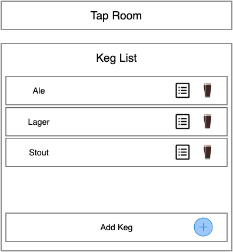

# _Tap Room_

 ### By Joseph Pearce

## Description

Tap Room is a web app to track keg inventory and decrement the amount by one pint for each pour.

## Wireframe

## User Stories 

* As a user, I want to see a list of all available kegs that show name, brand, price and alcoholContent. 
* As a user, I want to submit a form to add a new keg to a list.
* As a user, I want to be able to click on a keg to see its detail page.
* As a user, I want to see how many pints are left in a keg. A full keg has roughly 124 pints.
* As a user, I want to be able to click a button next to a keg whenever I sell a pint of it. This should decrease the number of pints left by 1. Pints should not be able to go below 0.

## To Run

* Open project in code editor of choice
* Run "npm install" to install all necessary dependencies
* Run "npm start" to open project in browser

## Support and contact details

_Please contact me through my Github_ 

## Technologies Used

* _HTML_
* _CSS_
* _JavaScript_
* _Webpack_
* _React_

### License

MIT License.

Copyright (c) 2020 

